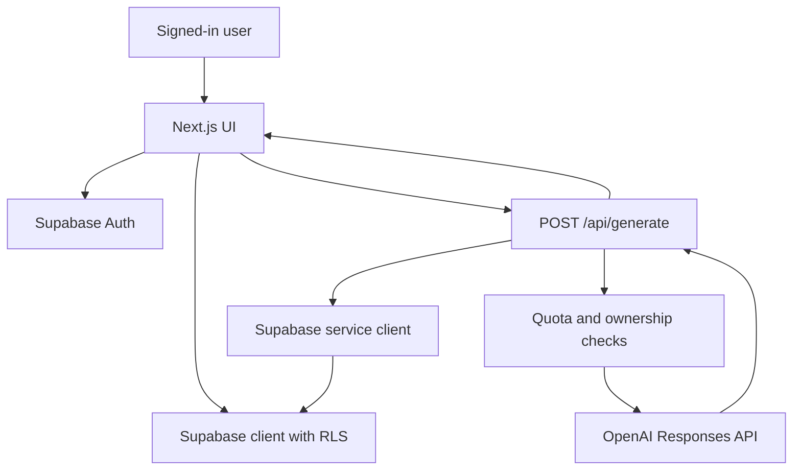

# AI Story Generation Design

## Goal

Turn the current offline novel generator into a logged-in AI story app: users can sign in, create stories, generate chapters with AI, choose A/B/C or custom actions, and continue across devices with Supabase-backed storage.

## Current State

The repo is currently a static HTML app:

- `index.html` redirects to the main HTML file.
- `諸天萬界小說生成系統_v4精簡可用離線故事資料庫版_v2完成版/諸天萬界小說生成系統_v4豪華版_主題相容ChatGPT接力版.html` contains the UI, offline story database, local generation logic, and `localStorage` persistence.
- There is no build system, no backend route, no Supabase schema, and no server-side secret handling.

## Selected Approach

Use the complete login version:

- Frontend: migrate to a Next.js app hosted on Vercel.
- Auth: Supabase Auth with email magic link first, Google OAuth optional after baseline works.
- Database: Supabase Postgres with RLS on every exposed table.
- AI: Vercel API route calls the OpenAI Responses API from the server.
- Streaming: chapter text streams back to the browser for a live writing feel.
- Persistence: story state, chapters, choices, summaries, and generation events are stored in Supabase.

OpenAI documentation recommends the Responses API for direct model requests and new text-generation work. The streaming guide supports server-sent event style output for long responses:

- https://developers.openai.com/api/docs/guides/text
- https://developers.openai.com/api/docs/guides/streaming-responses
- https://developers.openai.com/api/docs/guides/conversation-state
- https://developers.openai.com/api/docs/guides/structured-outputs

## Product Flow

1. User opens the app and signs in.
2. User creates a story by selecting theme, subtheme, protagonist, host identity, world, power, conflict, villain, and style.
3. User clicks "AI 生成第一章".
4. The UI streams generated text into the chapter panel.
5. The generated chapter is saved to Supabase with structured choices.
6. User chooses A/B/C or enters a custom action.
7. The app sends story metadata, memory summary, latest chapter, and chosen action to `/api/generate`.
8. AI generates the next chapter and choices.
9. The app updates story memory periodically so long stories stay affordable and coherent.

## Mobile-First Experience

The rebuilt app should treat mobile as the primary experience, not a compressed desktop layout. The main writing flow should work comfortably on a phone with one thumb:

- A sticky bottom action bar for primary actions such as generate, continue, save, and export.
- Full-width controls with generous tap targets for selectors and route choices.
- A single-column story creation flow on mobile, with progressive sections instead of dense two-column panels.
- Readable chapter text with stable line length, comfortable spacing, and no horizontal scrolling.
- Streaming generation status that stays visible without covering the chapter text.
- Desktop can add multi-column density, but mobile should remain the design baseline.

## Architecture



The browser never receives the OpenAI API key or Supabase service role key. The browser uses only the Supabase publishable/anon key. Server routes validate the current Supabase user before generating or saving content.

## Data Model

### `profiles`

Stores user-level display and quota data.

- `id uuid primary key references auth.users(id) on delete cascade`
- `email text`
- `display_name text`
- `plan text default 'free'`
- `created_at timestamptz default now()`
- `updated_at timestamptz default now()`

### `stories`

Stores story metadata and current generation settings.

- `id uuid primary key default gen_random_uuid()`
- `user_id uuid not null references auth.users(id) on delete cascade`
- `title text not null`
- `genre text`
- `theme_mode text not null`
- `sub_theme text`
- `story_engine text`
- `hero_type text`
- `host_type text`
- `world_core text`
- `power_core text`
- `conflict_core text`
- `villain_core text`
- `style_mode text`
- `core_idea text`
- `status text default 'draft'`
- `current_chapter integer default 0`
- `created_at timestamptz default now()`
- `updated_at timestamptz default now()`

### `chapters`

Stores generated chapters and the choice that led to them.

- `id uuid primary key default gen_random_uuid()`
- `story_id uuid not null references stories(id) on delete cascade`
- `user_id uuid not null references auth.users(id) on delete cascade`
- `chapter_number integer not null`
- `title text`
- `content text not null`
- `choices jsonb not null default '[]'::jsonb`
- `selected_choice text`
- `custom_action text`
- `model text`
- `created_at timestamptz default now()`

### `story_memories`

Stores rolling summaries for long-form continuity.

- `id uuid primary key default gen_random_uuid()`
- `story_id uuid not null references stories(id) on delete cascade`
- `user_id uuid not null references auth.users(id) on delete cascade`
- `summary text not null`
- `chapter_through integer not null`
- `created_at timestamptz default now()`

### `generation_events`

Stores audit and quota data for AI calls.

- `id uuid primary key default gen_random_uuid()`
- `user_id uuid not null references auth.users(id) on delete cascade`
- `story_id uuid references stories(id) on delete set null`
- `chapter_id uuid references chapters(id) on delete set null`
- `kind text not null`
- `model text not null`
- `status text not null`
- `input_tokens integer`
- `output_tokens integer`
- `error_message text`
- `created_at timestamptz default now()`

## Row Level Security

Enable RLS on every table in `public`.

Policies:

- `profiles`: users can select and update only their own profile.
- `stories`: users can select, insert, update, and delete only rows where `user_id = auth.uid()`.
- `chapters`: users can select, insert, update, and delete only rows where `user_id = auth.uid()`.
- `story_memories`: users can select, insert, update, and delete only rows where `user_id = auth.uid()`.
- `generation_events`: users can select only their own rows. Inserts happen through server routes using validated ownership.

Use `to authenticated` plus ownership predicates. Avoid `auth.role()` policies.

## API Design

### `POST /api/generate`

Input:

```json
{
  "storyId": "uuid",
  "mode": "first_chapter | next_chapter | outline | summarize",
  "choice": "A | B | C",
  "customAction": "optional user action"
}
```

Server behavior:

1. Read Supabase session from cookies.
2. Validate input with a schema.
3. Load the story and verify `story.user_id === user.id`.
4. Check quota from `generation_events`.
5. Build prompt from story settings, latest memory, latest chapter, and chosen action.
6. Call OpenAI Responses API.
7. Stream generated content to the browser.
8. Save final chapter and generation event after completion.

Output:

- Streaming text chunks for the UI.
- Final metadata containing `chapterId`, `chapterNumber`, and choices.

### `POST /api/stories`

Creates a story row from selected settings.

### `GET /api/stories`

Returns current user's story list.

### `GET /api/stories/:id`

Returns story detail, chapters, and latest memory.

## Prompt Strategy

Use a compact system prompt:

- Write in Traditional Chinese.
- Maintain the user's selected genre constraints.
- Continue the established memory and latest chapter.
- Output one chapter plus 3 choices.
- Avoid disclaimers and meta discussion.
- Keep chapter length within configured token budget.

Use structured output when not streaming choices, or derive choices from a clearly delimited ending block when streaming. The implementation should prefer streaming content first, then save a parsed final object.

## Model Choice

Use a configurable environment variable:

- `OPENAI_MODEL=gpt-5.4-mini` for initial cost control.
- Allow upgrading to a stronger model for premium or admin users later.

The model should be configured server-side only.

## Quota Design

Initial free tier:

- 20 generations per user per day.
- 100 generations per user per month.
- One generation event is written for every attempt, including failures.

Quota checks should run before calling OpenAI. Failed OpenAI calls should not consume successful quota, but should be visible in `generation_events`.

## Environment Variables

Vercel:

- `NEXT_PUBLIC_SUPABASE_URL`
- `NEXT_PUBLIC_SUPABASE_ANON_KEY`
- `SUPABASE_SERVICE_ROLE_KEY`
- `OPENAI_API_KEY`
- `OPENAI_MODEL`

Local:

- `.env.local` with the same variables.
- `.env.local` must stay gitignored.

Never store API keys in HTML, client JavaScript, README examples, or Supabase tables.

## Migration Plan

The implementation should preserve the current offline data bank by extracting the JavaScript constants into TypeScript modules:

- `src/lib/story-bank.ts`
- `src/lib/theme-rules.ts`
- `src/lib/story-state.ts`

Then rebuild the UI in React components while keeping the same labels and workflow.

## Testing Strategy

- Unit test prompt construction and schema validation.
- Unit test quota rules.
- Integration test Supabase RLS policies with at least two users.
- API route test for unauthorized, forbidden story access, quota exceeded, and successful mocked generation.
- E2E smoke test: sign in, create story, generate first chapter, choose next action, see saved chapter.
- Mobile viewport E2E smoke test: verify the main creation and generation controls are visible, tappable, and do not overflow at a common phone width.

## Open Questions

- Which login providers should ship first: email magic link only, Google only, or both?
- What exact daily/monthly generation limit should free users get?
- Should generated content be private only, or should public share links be added later?
- Should exported TXT remain purely client-side, or should export be generated from saved Supabase chapters?
